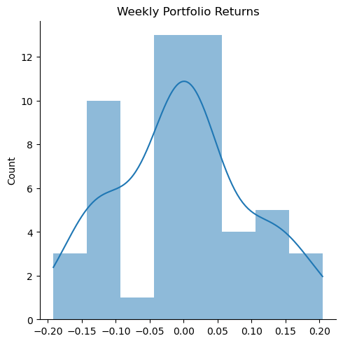

# Plotting mechanics and EDA

**Run the code below, and read along.**

In the last assignment, I gave you a list of firms from 2020 with variables
- "gvkey", "lpermno", "lpermno" = different datasets use different identifiers for firms
- "fyear" = the fiscal year the remaining variable apply to 
- "gsector" = gsector, an industry classification (see [the wiki article on GICS](https://en.wikipedia.org/wiki/Global_Industry_Classification_Standard))
- "state" = of headquarters
- "tic" = ticker
- various accounting statistics

This data is a small slice of Compustat, which is a professional grade dataset that contains accounting data from SEC filings. 

We downloaded it and found a subsample of firms that we were interested in:


```python
import pandas as pd
import numpy as np
import seaborn as sns
import pandas_datareader as pdr  # to install: !pip install pandas_datareader
from datetime import datetime
import matplotlib.pyplot as plt 
import yfinance as yf

plt.rcParams['patch.edgecolor'] = 'none' 

# this file can be found here: https://github.com/LeDataSciFi/ledatascifi-2021/tree/main/data
# if you click on the file, then click "raw", you'll be at the url below,
# which contains the raw data. pandas can download/load it without saving it locally!
url = 'https://github.com/LeDataSciFi/data/raw/main/Firm%20Year%20Datasets%20(Compustat)/firms2020.csv'
firms_df = pd.read_csv(url).drop_duplicates('tic') 

# add leverage 
firms_df['leverage'] = (firms_df['dlc']+firms_df['dltt'])/firms_df['at']

# high_lev = 1 if firm is above the median lev in its industry
firms_df['ind_med_lev'] = firms_df.groupby('gsector')['leverage'].transform('median')
firms_df.eval('high_leverage = leverage > ind_med_lev',inplace=True)

# problem: if lev is missing, the boolean above is false, so 
# high_lev = false... even if we don't know leverage!
# let's set those to missing (nan)
mask = (firms_df["leverage"].isnull()) | (firms_df["ind_med_lev"].isnull())
firms_df.loc[mask,"high_leverage"] = None

# reduce to subsample: (has leverage value and in our sectors)
subsample = firms_df.query('gsector in [45,20] & (high_leverage == 1 | high_leverage == 0)') 
ticker_list = subsample['tic'].to_list()
```

Now, 
1. I will download their daily stock returns, 
2. Compute (EW) portfolio returns,
3. Using (2), compute weekly total returns (cumulate the daily returns within each week). 
    - _Note: These are not buy-and-hold-returns, but rather **daily rebalancing!**_
    - _If you want buy-and-hold returns, you'd compute the weekly firm level returns, then average those compute the portfolio returns._


```python
##################################################################
# get daily firm stock returns
##################################################################

# I called this first df "stock_prices" in the last assignment

firm_rets   = (yf.download(ticker_list, 
                           start=datetime(2020, 2, 2), 
                           end=datetime(2020, 4, 30),
                           show_errors=False)
                .filter(like='Adj Close') # reduce to just columns with this in the name
                .droplevel(0,axis=1) # removes the level of the col vars that said "Adj Close", leaves symbols
               
                # reshape the data tall (3 vars: firm, date, price, return)
                .stack().swaplevel().sort_index().reset_index(name='Adj Close')
                .rename(columns={'level_0':'Firm'})
 
                # create ret vars and merge in firm-level info
                .assign(ret = lambda x: x.groupby('Firm')['Adj Close'].pct_change())
                .merge(subsample[['tic','gsector','high_leverage']],
                       left_on='Firm',
                       right_on='tic')
               
               )
 
##################################################################
# get daily portfolio returns
##################################################################

# these portfolio returns are EQUALLY weighted each day (the .mean())
# this is as if you bought all the firms in equal dollars at the beginning 
# of the day, which means "daily rebalancing" --> each day you rebalance
# your portfolio so that it's equally weighted at the start of the day

daily_port_ret = (firm_rets
                  # for each portfolio and for each day
                  .groupby(['high_leverage','gsector','Date']) 
                  ['ret'].mean()                       # avg the return for that day for the firms in the port
                  .reset_index()                       # you can work with high_leverage/sector/date as index or vars
                                                       # I decided to convert them to variables and sort                                                    
                  .sort_values(['high_leverage','gsector','Date'])
                 )

##################################################################
# get weekly portfolio returns
##################################################################

# we will cumulate the daily portfolio returns so now we have a  
# dataframe that contains weekly returns for a few different portfolios

weekly_port_ret = (daily_port_ret
                   # compute gross returns for each asset (and get the week var)
                   .assign(R = 1+daily_port_ret['ret'],
                           week = daily_port_ret['Date'].dt.isocalendar().week.astype("int64"))
                   
                   # sidenote: dt.isocalander creates a variable with type "UInt32"
                   # this doesn't play great with sns, so I turned it into an integer ("int64")
                   
                   # for each portfolio and week...
                   .groupby(['high_leverage','gsector','week'])
                   # cumulate the returns
                   ['R'].prod()
                   # subtract one
                   -1
                  ).to_frame()
                   # this last line above (to_frame) isn't strictly necessary, but 
                   # the plotting functions play nicer with frames than series objs

```

    [*********************100%***********************]  388 of 388 completed


## Our first plot

We can plot the weekly potfolio returns easily. 


```python
ax = weekly_port_ret.squeeze().unstack().T.plot()
# can access customization via matplotliab methods on ax 
plt.show()
```


    

    


Doing this in seaborn is easy too. 


```python
ax = sns.lineplot(data = weekly_port_ret,
             x='week',y='R',hue='high_leverage',style='gsector')
# can access customization via matplotlib methods on ax 
plt.show()

```


    

    


## Part 1 - Plot formatting

Insert cell(s) below this one as needed to finish this Part.

Improve the plot above.
- Q1: set the title to "Weekly Portfolio Returns - Daily Rebalancing"
- Q2: set the x-axis title to "Week in 2020"
- Q3: set the y-axis title to "Weekly Return"
- Q4: Ungraded bonus challenge: change the legend so it says the industry names, not the numbers 


```python
ax = sns.lineplot(data = weekly_port_ret,
             x='week',y='R',hue='high_leverage',style='gsector')
# Q1
plt.title("Weekly Portfolio Returns - Daily Rebalancing")
# Q2
plt.xlabel("Week in 2020")
# Q3
plt.ylabel("Weekly Return")
# Q4

plt.show()

```


    

    


## Part 2 - Replicate/Imitate

Insert cell(s) below each bullet point and create as close a match as you can. This includes titles, axis numbering, everything you see. 

- Q5: Replicate F1.png. Notice the x-axis has no label - it's in the title.


```python
Q5_plot=sns.displot(data=weekly_port_ret,x='R',kde=True)
Q5_plot.set(xlabel=None)
plt.title('Weekly Portfolio Returns')
plt.show()
```


    

    


- Q6: Replicate F2.png. Notice the bin sizes are 5%.


```python
Q6_plot=sns.displot(data=weekly_port_ret,x='R',bins=np.arange(-0.4, 0.4, 0.05))
Q6_plot.set(xlabel=None)
plt.title('Weekly Portfolio Returns')
plt.show()
```


    

    


- Q7: Replicate F3.png. Pay attention to the header for a clue! 
    


```python
plt.figure(figsize=(5, 7)) 
sns.boxplot(y='ret', data=firm_rets, color='steelblue')
plt.title('Firm Daily Return')
plt.show()
```


    

    


  

- Q8: Replicate F4.png. Pay attention to the header for a clue!
    


```python
plt.figure(figsize=(5, 6)) 
sns.boxplot(x='high_leverage', y='ret', data=firm_rets)
plt.title('Firm Daily Return')
plt.show()
```


    

    


  

- Q9: Replicate this figure, using this `total` dataset:

```python
total = pd.DataFrame() # open an empty dataframe
total['ret'] = (firm_rets.assign(ret=firm_rets['ret']+1) # now we have R(t) for each observation
                       .groupby('tic')['ret']    # for each firm,
                       .prod()                      # multiple all the gross returns
                       -1                           # and subtract one to get back to the total period return
)
total['cnt'] = firm_rets.groupby('tic')['ret'].count()
total['std'] = firm_rets.groupby('tic')['ret'].std()*np.sqrt(total['cnt'])
total = total.merge(firm_rets.groupby('tic')[['high_leverage','gsector']].first(), 
                    left_index=True, right_index=True)
```


```python
total = pd.DataFrame() # open an empty dataframe
total['ret'] = (firm_rets.assign(ret=firm_rets['ret']+1) # now we have R(t) for each observation
                       .groupby('tic')['ret']    # for each firm,
                       .prod()                      # multiple all the gross returns
                       -1                           # and subtract one to get back to the total period return
)
total['cnt'] = firm_rets.groupby('tic')['ret'].count()
total['std'] = firm_rets.groupby('tic')['ret'].std()*np.sqrt(total['cnt'])
total = total.merge(firm_rets.groupby('tic')[['high_leverage','gsector']].first(), 
                    left_index=True, right_index=True)
```


```python
total
```


<div>
<style scoped>
    .dataframe tbody tr th:only-of-type {
        vertical-align: middle;
    }

    .dataframe tbody tr th {
        vertical-align: top;
    }

    .dataframe thead th {
        text-align: right;
    }
</style>
<table border="1" class="dataframe">
  <thead>
    <tr style="text-align: right;">
      <th></th>
      <th>ret</th>
      <th>cnt</th>
      <th>std</th>
      <th>high_leverage</th>
      <th>gsector</th>
    </tr>
    <tr>
      <th>tic</th>
      <th></th>
      <th></th>
      <th></th>
      <th></th>
      <th></th>
    </tr>
  </thead>
  <tbody>
    <tr>
      <th>AAPL</th>
      <td>-0.065597</td>
      <td>60</td>
      <td>0.348535</td>
      <td>True</td>
      <td>45.0</td>
    </tr>
    <tr>
      <th>ABM</th>
      <td>-0.064676</td>
      <td>60</td>
      <td>0.426696</td>
      <td>False</td>
      <td>20.0</td>
    </tr>
    <tr>
      <th>ACLS</th>
      <td>0.048741</td>
      <td>60</td>
      <td>0.557596</td>
      <td>False</td>
      <td>45.0</td>
    </tr>
    <tr>
      <th>ACM</th>
      <td>-0.225210</td>
      <td>60</td>
      <td>0.438323</td>
      <td>False</td>
      <td>20.0</td>
    </tr>
    <tr>
      <th>ACN</th>
      <td>-0.093329</td>
      <td>60</td>
      <td>0.347341</td>
      <td>False</td>
      <td>45.0</td>
    </tr>
    <tr>
      <th>...</th>
      <td>...</td>
      <td>...</td>
      <td>...</td>
      <td>...</td>
      <td>...</td>
    </tr>
    <tr>
      <th>XRX</th>
      <td>-0.468449</td>
      <td>60</td>
      <td>0.473751</td>
      <td>True</td>
      <td>45.0</td>
    </tr>
    <tr>
      <th>XYL</th>
      <td>-0.111853</td>
      <td>60</td>
      <td>0.371912</td>
      <td>True</td>
      <td>20.0</td>
    </tr>
    <tr>
      <th>YELL</th>
      <td>-0.254464</td>
      <td>60</td>
      <td>0.671546</td>
      <td>True</td>
      <td>20.0</td>
    </tr>
    <tr>
      <th>ZBRA</th>
      <td>0.009977</td>
      <td>60</td>
      <td>0.388039</td>
      <td>True</td>
      <td>45.0</td>
    </tr>
    <tr>
      <th>ZS</th>
      <td>0.172650</td>
      <td>60</td>
      <td>0.383923</td>
      <td>True</td>
      <td>45.0</td>
    </tr>
  </tbody>
</table>
<p>342 rows × 5 columns</p>
</div>


```python
sns.scatterplot( x="std", y="ret", data=total, hue='high_leverage',style = 'gsector')
plt.legend(loc='upper right')
plt.title("Risk and Return (Feb, Mar, Apr 2020)")
plt.xlabel("STD of Return")
plt.ylabel("Return")
plt.show() 
```


    

    


## Q10: Choose your adventure. Some ideas:
- Use a pairplot, jointplot, or heatmap on any data already loaded on this page (including the original `firms_df`). 
- Convert any of the stock price datasets to a "wide" format and then use the pair_hex_bin code from the communiy codebook.
- Do something fun with the parameters of the function you choose. 
- [Or adapt this](https://seaborn.pydata.org/examples/timeseries_facets.html) to improve  our portfolio returns plot from Part 1, because Part 1 created a tough to interpret "spaghetti" plot!
- Plot the _cumulative_ returns over the sample period for the four portfolios' weekly returns from Part 1
- [Adapt this](https://seaborn.pydata.org/examples/timeseries_facets.html) to improve  our weekly portfolio returns plot from Part 1.

Then save the figure as a png file and [share it here on the discussion board](https://github.com/orgs/LeDataSciFi/teams/classmates-2023/discussions/21).


```python
sns.set_theme(style="dark")

# Plot each year's time series in its own facet
g = sns.relplot(
    data=weekly_port_ret,
    x="week", y="R", col="gsector", hue="high_leverage",
    kind="line", palette="crest", linewidth=1, zorder=6,
    col_wrap=2, height=3, aspect=1.5, legend=True,
)

# Iterate over each subplot to customize further
for year, ax in g.axes_dict.items():
    # Plot every year's time series in the background
    sns.lineplot(
        data=weekly_port_ret, x="week", y="R", units="high_leverage",
        estimator=None, color=".7", linewidth=1, ax=ax,
    )

# Tweak the supporting aspects of the plot
g.set_titles("Weekly Portfolio Returns")
g.set_axis_labels("Weeks", "Returns")
g.tight_layout()
```


    

    


```python

```
