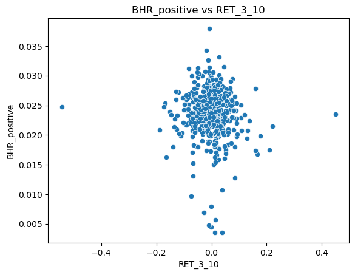

```python

from scipy.stats import pearsonr
import pandas as pd
import matplotlib.pyplot as plt
import seaborn as sns
```


```python
df2 = pd.read_pickle('df2.pickle')
```


```python
RET = pd.read_pickle('RET.pickle')
```

# Summary section 

For this assignment here, I mainly focused on building 'build_sample' and 'download_text_files'. In 'download_text_files', I downloaded 499 out of 503 firms. The reason would be that some of the S&P 500 firms do not hold or upload a 10-K file. For 'build_sample', there are two important thing I did. One is to calculate the sentiment measurement for 10-K files and the other is to get the returns around the 10-K dates. Besides the provided 4 sentiment, I tried to find risk-related word, crime-related word and people-related word, which has its own positive and negative aspect. 


```python

```

# Data section

- There are mainly two samples here. One is df2, which works for 10 sentiment measurement and the other is RET, which contains “buy and hold” around the 10-K date.


```python

```

- For RET, I first import the 'sp500_2022' and 'crsp_2022_only.zip' as 'ret' into the notebook. I merged these two dataframes according to their 'Symbol'. 'new_sp500_2022' is what I got for my previous step. Then I applied ```HTMLSession()```to get the filing data for each 10-K files from 'www.sec.gov'. Using inspect to get ```r.html.find('div.formGrouping:nth-child(1) > div:nth-child(2)'``` as their filing date. I merged this dataframe I just get with ret I mentioned before to get newest_sp500_2022 which includes filing dates for each 10-K. Finally, I used ```for loop along with iterrows and ifelse statement``` to get 'ret_0_2' and 'ret_3_10' which represent for  “buy and hold” around the 10-K date. 


```python

```

- For df2, I first use the code from what we learned from class to import four sentiment word list in to the notebook, which are BHR_positive, BHR_negative, LM_positive, and LM_negative. And then I define the other three topics, which are risk, crime, and people for both positive and negative side. By using ```with ZipFile('10k_files/10k_files.zip','r') as zipfolder```, I make a dataframe for these 10-K files and named them ```files```. Next, I applied ```df = file.copy()``` to make a copy of file and the code from class to make a ```for loop``` here to make every 10-K file into a dataframe with their 'accession_number' and 'symbol'. I defined a function called 'sentiment_analysis' to get all firms' 10 sentiment scores, which is df2.


```python

```

- The reason I choose risk is because Finance is always dealing with risks. As a saying goes, higher risks, higher returns. The measurement of risk level would definitely influence the company's operation. 
- The reason I choose crime is that there are many many event in firms are related to crime. The crime-related word would tell us if there is anything serious that lead the firm on the wrong track or they are rejecting crime all the time. 
- The reason I choose people is also obvious. People is the essence of anything including finance and firm. Without people interaction, firm loses something. Employee is the basic of firm. If the employee performed negatively, the firm won't get on the right path to success.


```python

```

- For what I noticed from the df2 dataframe, I noticed that BHR_positive, BHR_negative, LM_positive, LM_negative gain relatively higher sentiment scores than the topics I choose. It means that these sentiment are better at determining the tone of the 10-K files. Most of them are around 0.025 for BHR_positive, BHR_negative and 0.01 for LM_positive, LM_negative. Also, I noticed that there is always one sentiment that has higher sentiment score when compared inside the positive or negative side, which means most of the 10-files are either positive or negative. There won't be much neutral tone inside the 10-files.
- For RET, it is not quite clear whether there is a relationship between 'RET_0_2' and 'RET_3_10'. But this will be clear when I apply a graph for this dataframe.


```python
df2
```


<div>
<style scoped>
    .dataframe tbody tr th:only-of-type {
        vertical-align: middle;
    }

    .dataframe tbody tr th {
        vertical-align: top;
    }

    .dataframe thead th {
        text-align: right;
    }
</style>
<table border="1" class="dataframe">
  <thead>
    <tr style="text-align: right;">
      <th></th>
      <th>filling_id</th>
      <th>Symbol</th>
      <th>cleaned_html</th>
      <th>BHR_positive</th>
      <th>BHR_negative</th>
      <th>LM_positive</th>
      <th>LM_negative</th>
      <th>risk_positive</th>
      <th>risk_negative</th>
      <th>crime_positive</th>
      <th>crime_negative</th>
      <th>people_positive</th>
      <th>people_negative</th>
    </tr>
  </thead>
  <tbody>
    <tr>
      <th>0</th>
      <td>0000066740-22-000010</td>
      <td>MMM</td>
      <td>mmm 20211231table of contentsunited statessec...</td>
      <td>0.025683</td>
      <td>0.031662</td>
      <td>0.003977</td>
      <td>0.023249</td>
      <td>0.001753</td>
      <td>0.003807</td>
      <td>0.000798</td>
      <td>0.000079</td>
      <td>0.000000</td>
      <td>0.000000</td>
    </tr>
    <tr>
      <th>1</th>
      <td>0000091142-22-000028</td>
      <td>AOS</td>
      <td>aos 20211231united states securities and exch...</td>
      <td>0.024460</td>
      <td>0.023602</td>
      <td>0.003756</td>
      <td>0.012984</td>
      <td>0.001686</td>
      <td>0.003727</td>
      <td>0.000414</td>
      <td>0.000118</td>
      <td>0.000000</td>
      <td>0.000000</td>
    </tr>
    <tr>
      <th>2</th>
      <td>0001104659-22-025141</td>
      <td>ABT</td>
      <td>0000001800 12 312021fyfalsehttp fasb org us ga...</td>
      <td>0.021590</td>
      <td>0.024394</td>
      <td>0.003726</td>
      <td>0.012793</td>
      <td>0.002497</td>
      <td>0.002094</td>
      <td>0.000615</td>
      <td>0.000173</td>
      <td>0.000000</td>
      <td>0.000038</td>
    </tr>
    <tr>
      <th>3</th>
      <td>0001551152-22-000007</td>
      <td>ABBV</td>
      <td>abbv 20211231united statessecurities and exch...</td>
      <td>0.019753</td>
      <td>0.022645</td>
      <td>0.006481</td>
      <td>0.015448</td>
      <td>0.003168</td>
      <td>0.001852</td>
      <td>0.000763</td>
      <td>0.000179</td>
      <td>0.000000</td>
      <td>0.000000</td>
    </tr>
    <tr>
      <th>4</th>
      <td>0001467373-22-000295</td>
      <td>ACN</td>
      <td>acn 20220831table of contentsunited states se...</td>
      <td>0.027968</td>
      <td>0.023964</td>
      <td>0.008642</td>
      <td>0.016861</td>
      <td>0.003388</td>
      <td>0.002233</td>
      <td>0.000654</td>
      <td>0.000135</td>
      <td>0.000038</td>
      <td>0.000038</td>
    </tr>
    <tr>
      <th>...</th>
      <td>...</td>
      <td>...</td>
      <td>...</td>
      <td>...</td>
      <td>...</td>
      <td>...</td>
      <td>...</td>
      <td>...</td>
      <td>...</td>
      <td>...</td>
      <td>...</td>
      <td>...</td>
      <td>...</td>
    </tr>
    <tr>
      <th>491</th>
      <td>0001564590-22-007640</td>
      <td>YUM</td>
      <td>yumc 10k_20211231 htm united states securitie...</td>
      <td>0.025014</td>
      <td>0.023482</td>
      <td>0.006078</td>
      <td>0.016549</td>
      <td>0.002541</td>
      <td>0.001425</td>
      <td>0.000641</td>
      <td>0.000178</td>
      <td>0.000012</td>
      <td>0.000036</td>
    </tr>
    <tr>
      <th>492</th>
      <td>0000877212-22-000026</td>
      <td>ZBRA</td>
      <td>zbra 20211231table of contentsunited statesse...</td>
      <td>0.028396</td>
      <td>0.026842</td>
      <td>0.006258</td>
      <td>0.014964</td>
      <td>0.001916</td>
      <td>0.001809</td>
      <td>0.000617</td>
      <td>0.000234</td>
      <td>0.000000</td>
      <td>0.000000</td>
    </tr>
    <tr>
      <th>493</th>
      <td>0001564590-22-007160</td>
      <td>ZBH</td>
      <td>zbh 10k_20211231 htm i have united states sec...</td>
      <td>0.021506</td>
      <td>0.026759</td>
      <td>0.004591</td>
      <td>0.021783</td>
      <td>0.001833</td>
      <td>0.002912</td>
      <td>0.000786</td>
      <td>0.000262</td>
      <td>0.000000</td>
      <td>0.000015</td>
    </tr>
    <tr>
      <th>494</th>
      <td>0001213900-22-013250</td>
      <td>ZION</td>
      <td>united states securities and exchange commiss...</td>
      <td>0.016075</td>
      <td>0.016980</td>
      <td>0.003070</td>
      <td>0.013458</td>
      <td>0.001680</td>
      <td>0.002230</td>
      <td>0.000372</td>
      <td>0.000065</td>
      <td>0.000048</td>
      <td>0.000000</td>
    </tr>
    <tr>
      <th>495</th>
      <td>0001555280-22-000078</td>
      <td>ZTS</td>
      <td>zts 20211231table of contentsunited states se...</td>
      <td>0.021790</td>
      <td>0.033508</td>
      <td>0.005036</td>
      <td>0.019980</td>
      <td>0.002996</td>
      <td>0.001760</td>
      <td>0.000612</td>
      <td>0.000166</td>
      <td>0.000026</td>
      <td>0.000013</td>
    </tr>
  </tbody>
</table>
<p>496 rows × 13 columns</p>
</div>


```python
df2.describe()
```


<div>
<style scoped>
    .dataframe tbody tr th:only-of-type {
        vertical-align: middle;
    }

    .dataframe tbody tr th {
        vertical-align: top;
    }

    .dataframe thead th {
        text-align: right;
    }
</style>
<table border="1" class="dataframe">
  <thead>
    <tr style="text-align: right;">
      <th></th>
      <th>BHR_positive</th>
      <th>BHR_negative</th>
      <th>LM_positive</th>
      <th>LM_negative</th>
      <th>risk_positive</th>
      <th>risk_negative</th>
      <th>crime_positive</th>
      <th>crime_negative</th>
      <th>people_positive</th>
      <th>people_negative</th>
    </tr>
  </thead>
  <tbody>
    <tr>
      <th>count</th>
      <td>496.000000</td>
      <td>496.000000</td>
      <td>496.000000</td>
      <td>496.000000</td>
      <td>496.000000</td>
      <td>496.000000</td>
      <td>496.000000</td>
      <td>496.000000</td>
      <td>496.000000</td>
      <td>496.000000</td>
    </tr>
    <tr>
      <th>mean</th>
      <td>0.023510</td>
      <td>0.025476</td>
      <td>0.004929</td>
      <td>0.015821</td>
      <td>0.002051</td>
      <td>0.002397</td>
      <td>0.000690</td>
      <td>0.000149</td>
      <td>0.000017</td>
      <td>0.000010</td>
    </tr>
    <tr>
      <th>std</th>
      <td>0.004108</td>
      <td>0.003692</td>
      <td>0.001378</td>
      <td>0.003886</td>
      <td>0.000853</td>
      <td>0.001002</td>
      <td>0.000454</td>
      <td>0.000114</td>
      <td>0.000028</td>
      <td>0.000019</td>
    </tr>
    <tr>
      <th>min</th>
      <td>0.003530</td>
      <td>0.008953</td>
      <td>0.000272</td>
      <td>0.002541</td>
      <td>0.000569</td>
      <td>0.000000</td>
      <td>0.000104</td>
      <td>0.000000</td>
      <td>0.000000</td>
      <td>0.000000</td>
    </tr>
    <tr>
      <th>25%</th>
      <td>0.021520</td>
      <td>0.023554</td>
      <td>0.004011</td>
      <td>0.013240</td>
      <td>0.001473</td>
      <td>0.001841</td>
      <td>0.000403</td>
      <td>0.000077</td>
      <td>0.000000</td>
      <td>0.000000</td>
    </tr>
    <tr>
      <th>50%</th>
      <td>0.023888</td>
      <td>0.025689</td>
      <td>0.004845</td>
      <td>0.015546</td>
      <td>0.001949</td>
      <td>0.002252</td>
      <td>0.000579</td>
      <td>0.000116</td>
      <td>0.000009</td>
      <td>0.000000</td>
    </tr>
    <tr>
      <th>75%</th>
      <td>0.025936</td>
      <td>0.027566</td>
      <td>0.005651</td>
      <td>0.017897</td>
      <td>0.002471</td>
      <td>0.002707</td>
      <td>0.000835</td>
      <td>0.000193</td>
      <td>0.000024</td>
      <td>0.000015</td>
    </tr>
    <tr>
      <th>max</th>
      <td>0.037982</td>
      <td>0.038030</td>
      <td>0.010899</td>
      <td>0.035088</td>
      <td>0.006665</td>
      <td>0.009605</td>
      <td>0.005736</td>
      <td>0.000870</td>
      <td>0.000178</td>
      <td>0.000188</td>
    </tr>
  </tbody>
</table>
</div>


```python

```


```python
RET
```


<div>
<style scoped>
    .dataframe tbody tr th:only-of-type {
        vertical-align: middle;
    }

    .dataframe tbody tr th {
        vertical-align: top;
    }

    .dataframe thead th {
        text-align: right;
    }
</style>
<table border="1" class="dataframe">
  <thead>
    <tr style="text-align: right;">
      <th></th>
      <th>Symbol</th>
      <th>RET_0_2</th>
      <th>RET_3_10</th>
    </tr>
  </thead>
  <tbody>
    <tr>
      <th>0</th>
      <td>A</td>
      <td>0.008788</td>
      <td>0.004322</td>
    </tr>
    <tr>
      <th>1</th>
      <td>AAL</td>
      <td>-0.050923</td>
      <td>-0.139741</td>
    </tr>
    <tr>
      <th>2</th>
      <td>AAP</td>
      <td>-0.017255</td>
      <td>-0.067329</td>
    </tr>
    <tr>
      <th>3</th>
      <td>AAPL</td>
      <td>0.075553</td>
      <td>-0.106518</td>
    </tr>
    <tr>
      <th>4</th>
      <td>ABBV</td>
      <td>-0.006484</td>
      <td>0.025967</td>
    </tr>
    <tr>
      <th>...</th>
      <td>...</td>
      <td>...</td>
      <td>...</td>
    </tr>
    <tr>
      <th>488</th>
      <td>ZBH</td>
      <td>0.026077</td>
      <td>-0.060145</td>
    </tr>
    <tr>
      <th>489</th>
      <td>ZBRA</td>
      <td>-0.127031</td>
      <td>-0.048513</td>
    </tr>
    <tr>
      <th>490</th>
      <td>ZION</td>
      <td>-0.014667</td>
      <td>0.047605</td>
    </tr>
    <tr>
      <th>491</th>
      <td>ZTS</td>
      <td>-0.017105</td>
      <td>0.008494</td>
    </tr>
    <tr>
      <th>492</th>
      <td>FAST</td>
      <td>NaN</td>
      <td>0.016783</td>
    </tr>
  </tbody>
</table>
<p>493 rows × 3 columns</p>
</div>


```python
RET.describe()
```


<div>
<style scoped>
    .dataframe tbody tr th:only-of-type {
        vertical-align: middle;
    }

    .dataframe tbody tr th {
        vertical-align: top;
    }

    .dataframe thead th {
        text-align: right;
    }
</style>
<table border="1" class="dataframe">
  <thead>
    <tr style="text-align: right;">
      <th></th>
      <th>RET_0_2</th>
      <th>RET_3_10</th>
    </tr>
  </thead>
  <tbody>
    <tr>
      <th>count</th>
      <td>492.000000</td>
      <td>492.000000</td>
    </tr>
    <tr>
      <th>mean</th>
      <td>0.007006</td>
      <td>-0.003495</td>
    </tr>
    <tr>
      <th>std</th>
      <td>0.045087</td>
      <td>0.062729</td>
    </tr>
    <tr>
      <th>min</th>
      <td>-0.279230</td>
      <td>-0.542923</td>
    </tr>
    <tr>
      <th>25%</th>
      <td>-0.016821</td>
      <td>-0.033890</td>
    </tr>
    <tr>
      <th>50%</th>
      <td>0.003450</td>
      <td>-0.001494</td>
    </tr>
    <tr>
      <th>75%</th>
      <td>0.030423</td>
      <td>0.026293</td>
    </tr>
    <tr>
      <th>max</th>
      <td>0.348567</td>
      <td>0.449406</td>
    </tr>
  </tbody>
</table>
</div>


```python

```

- Yeah, things happened. What I expected is that the topic I choose will significantly correlated to firms positiveness or negativeness. But all I get is less related than what we have previously. However, there are still two things acceptable. One is that all my sentiment scores are different, which in other word means that at least my ```for loop``` is partially correct. The other is that the firm I interested in all showed a positive tone for my sentiment.


```python

```

# Results


```python
final = pd.merge(RET,df2,on = 'Symbol', how = 'outer')
final
```


<div>
<style scoped>
    .dataframe tbody tr th:only-of-type {
        vertical-align: middle;
    }

    .dataframe tbody tr th {
        vertical-align: top;
    }

    .dataframe thead th {
        text-align: right;
    }
</style>
<table border="1" class="dataframe">
  <thead>
    <tr style="text-align: right;">
      <th></th>
      <th>Symbol</th>
      <th>RET_0_2</th>
      <th>RET_3_10</th>
      <th>filling_id</th>
      <th>cleaned_html</th>
      <th>BHR_positive</th>
      <th>BHR_negative</th>
      <th>LM_positive</th>
      <th>LM_negative</th>
      <th>risk_positive</th>
      <th>risk_negative</th>
      <th>crime_positive</th>
      <th>crime_negative</th>
      <th>people_positive</th>
      <th>people_negative</th>
    </tr>
  </thead>
  <tbody>
    <tr>
      <th>0</th>
      <td>A</td>
      <td>0.008788</td>
      <td>0.004322</td>
      <td>0000046619-22-000066</td>
      <td>hei 20221031united statessecurities and excha...</td>
      <td>0.025263</td>
      <td>0.018774</td>
      <td>0.004013</td>
      <td>0.008651</td>
      <td>0.002096</td>
      <td>0.001293</td>
      <td>0.000580</td>
      <td>0.000134</td>
      <td>0.000067</td>
      <td>0.000045</td>
    </tr>
    <tr>
      <th>1</th>
      <td>AAL</td>
      <td>-0.050923</td>
      <td>-0.139741</td>
      <td>0000006201-22-000026</td>
      <td>aal 20211231united states securities and exch...</td>
      <td>0.017957</td>
      <td>0.023794</td>
      <td>0.002809</td>
      <td>0.013274</td>
      <td>0.000687</td>
      <td>0.002156</td>
      <td>0.001099</td>
      <td>0.000048</td>
      <td>0.000014</td>
      <td>0.000041</td>
    </tr>
    <tr>
      <th>2</th>
      <td>AAP</td>
      <td>-0.017255</td>
      <td>-0.067329</td>
      <td>0001158449-22-000037</td>
      <td>aap 20220101table of contents united statesse...</td>
      <td>0.025962</td>
      <td>0.025993</td>
      <td>0.005076</td>
      <td>0.017441</td>
      <td>0.001353</td>
      <td>0.001846</td>
      <td>0.000554</td>
      <td>0.000185</td>
      <td>0.000062</td>
      <td>0.000000</td>
    </tr>
    <tr>
      <th>3</th>
      <td>AAPL</td>
      <td>0.075553</td>
      <td>-0.106518</td>
      <td>0000320193-22-000108</td>
      <td>aapl 20220924united statessecurities and exch...</td>
      <td>0.020384</td>
      <td>0.026536</td>
      <td>0.003438</td>
      <td>0.019268</td>
      <td>0.001327</td>
      <td>0.001839</td>
      <td>0.000814</td>
      <td>0.000181</td>
      <td>0.000030</td>
      <td>0.000121</td>
    </tr>
    <tr>
      <th>4</th>
      <td>ABBV</td>
      <td>-0.006484</td>
      <td>0.025967</td>
      <td>0001551152-22-000007</td>
      <td>abbv 20211231united statessecurities and exch...</td>
      <td>0.019753</td>
      <td>0.022645</td>
      <td>0.006481</td>
      <td>0.015448</td>
      <td>0.003168</td>
      <td>0.001852</td>
      <td>0.000763</td>
      <td>0.000179</td>
      <td>0.000000</td>
      <td>0.000000</td>
    </tr>
    <tr>
      <th>...</th>
      <td>...</td>
      <td>...</td>
      <td>...</td>
      <td>...</td>
      <td>...</td>
      <td>...</td>
      <td>...</td>
      <td>...</td>
      <td>...</td>
      <td>...</td>
      <td>...</td>
      <td>...</td>
      <td>...</td>
      <td>...</td>
      <td>...</td>
    </tr>
    <tr>
      <th>491</th>
      <td>ZTS</td>
      <td>-0.017105</td>
      <td>0.008494</td>
      <td>0001555280-22-000078</td>
      <td>zts 20211231table of contentsunited states se...</td>
      <td>0.021790</td>
      <td>0.033508</td>
      <td>0.005036</td>
      <td>0.019980</td>
      <td>0.002996</td>
      <td>0.001760</td>
      <td>0.000612</td>
      <td>0.000166</td>
      <td>0.000026</td>
      <td>0.000013</td>
    </tr>
    <tr>
      <th>492</th>
      <td>FAST</td>
      <td>NaN</td>
      <td>0.016783</td>
      <td>0001193125-22-106571</td>
      <td>10 k falsefy0 250 8330 833yesfast radius inc ...</td>
      <td>0.017014</td>
      <td>0.022257</td>
      <td>0.005885</td>
      <td>0.021064</td>
      <td>0.003343</td>
      <td>0.001874</td>
      <td>0.000970</td>
      <td>0.000210</td>
      <td>0.000026</td>
      <td>0.000000</td>
    </tr>
    <tr>
      <th>493</th>
      <td>BALL</td>
      <td>NaN</td>
      <td>NaN</td>
      <td>0001558370-22-001251</td>
      <td>http fasb org us gaap 2021 01 31 otherassetsno...</td>
      <td>0.022260</td>
      <td>0.023719</td>
      <td>0.004586</td>
      <td>0.011245</td>
      <td>0.002207</td>
      <td>0.003205</td>
      <td>0.000365</td>
      <td>0.000096</td>
      <td>0.000000</td>
      <td>0.000000</td>
    </tr>
    <tr>
      <th>494</th>
      <td>META</td>
      <td>NaN</td>
      <td>NaN</td>
      <td>0000950170-22-002601</td>
      <td>10 k 12 310 5unlimitedfalse00014319590 50 5fy...</td>
      <td>0.017594</td>
      <td>0.018674</td>
      <td>0.003788</td>
      <td>0.013731</td>
      <td>0.002860</td>
      <td>0.003561</td>
      <td>0.001193</td>
      <td>0.000114</td>
      <td>0.000038</td>
      <td>0.000038</td>
    </tr>
    <tr>
      <th>495</th>
      <td>WELL</td>
      <td>NaN</td>
      <td>NaN</td>
      <td>0000950170-22-005071</td>
      <td>10 k 00016703490 2857142857no0 2857142857fals...</td>
      <td>0.021229</td>
      <td>0.026493</td>
      <td>0.003515</td>
      <td>0.017825</td>
      <td>0.001308</td>
      <td>0.002411</td>
      <td>0.000567</td>
      <td>0.000095</td>
      <td>0.000158</td>
      <td>0.000000</td>
    </tr>
  </tbody>
</table>
<p>496 rows × 15 columns</p>
</div>


```python
new_df = final.iloc[:, -14:].drop(columns=['filling_id', 'cleaned_html'])
new_df
```


<div>
<style scoped>
    .dataframe tbody tr th:only-of-type {
        vertical-align: middle;
    }

    .dataframe tbody tr th {
        vertical-align: top;
    }

    .dataframe thead th {
        text-align: right;
    }
</style>
<table border="1" class="dataframe">
  <thead>
    <tr style="text-align: right;">
      <th></th>
      <th>RET_0_2</th>
      <th>RET_3_10</th>
      <th>BHR_positive</th>
      <th>BHR_negative</th>
      <th>LM_positive</th>
      <th>LM_negative</th>
      <th>risk_positive</th>
      <th>risk_negative</th>
      <th>crime_positive</th>
      <th>crime_negative</th>
      <th>people_positive</th>
      <th>people_negative</th>
    </tr>
  </thead>
  <tbody>
    <tr>
      <th>0</th>
      <td>0.008788</td>
      <td>0.004322</td>
      <td>0.025263</td>
      <td>0.018774</td>
      <td>0.004013</td>
      <td>0.008651</td>
      <td>0.002096</td>
      <td>0.001293</td>
      <td>0.000580</td>
      <td>0.000134</td>
      <td>0.000067</td>
      <td>0.000045</td>
    </tr>
    <tr>
      <th>1</th>
      <td>-0.050923</td>
      <td>-0.139741</td>
      <td>0.017957</td>
      <td>0.023794</td>
      <td>0.002809</td>
      <td>0.013274</td>
      <td>0.000687</td>
      <td>0.002156</td>
      <td>0.001099</td>
      <td>0.000048</td>
      <td>0.000014</td>
      <td>0.000041</td>
    </tr>
    <tr>
      <th>2</th>
      <td>-0.017255</td>
      <td>-0.067329</td>
      <td>0.025962</td>
      <td>0.025993</td>
      <td>0.005076</td>
      <td>0.017441</td>
      <td>0.001353</td>
      <td>0.001846</td>
      <td>0.000554</td>
      <td>0.000185</td>
      <td>0.000062</td>
      <td>0.000000</td>
    </tr>
    <tr>
      <th>3</th>
      <td>0.075553</td>
      <td>-0.106518</td>
      <td>0.020384</td>
      <td>0.026536</td>
      <td>0.003438</td>
      <td>0.019268</td>
      <td>0.001327</td>
      <td>0.001839</td>
      <td>0.000814</td>
      <td>0.000181</td>
      <td>0.000030</td>
      <td>0.000121</td>
    </tr>
    <tr>
      <th>4</th>
      <td>-0.006484</td>
      <td>0.025967</td>
      <td>0.019753</td>
      <td>0.022645</td>
      <td>0.006481</td>
      <td>0.015448</td>
      <td>0.003168</td>
      <td>0.001852</td>
      <td>0.000763</td>
      <td>0.000179</td>
      <td>0.000000</td>
      <td>0.000000</td>
    </tr>
    <tr>
      <th>...</th>
      <td>...</td>
      <td>...</td>
      <td>...</td>
      <td>...</td>
      <td>...</td>
      <td>...</td>
      <td>...</td>
      <td>...</td>
      <td>...</td>
      <td>...</td>
      <td>...</td>
      <td>...</td>
    </tr>
    <tr>
      <th>491</th>
      <td>-0.017105</td>
      <td>0.008494</td>
      <td>0.021790</td>
      <td>0.033508</td>
      <td>0.005036</td>
      <td>0.019980</td>
      <td>0.002996</td>
      <td>0.001760</td>
      <td>0.000612</td>
      <td>0.000166</td>
      <td>0.000026</td>
      <td>0.000013</td>
    </tr>
    <tr>
      <th>492</th>
      <td>NaN</td>
      <td>0.016783</td>
      <td>0.017014</td>
      <td>0.022257</td>
      <td>0.005885</td>
      <td>0.021064</td>
      <td>0.003343</td>
      <td>0.001874</td>
      <td>0.000970</td>
      <td>0.000210</td>
      <td>0.000026</td>
      <td>0.000000</td>
    </tr>
    <tr>
      <th>493</th>
      <td>NaN</td>
      <td>NaN</td>
      <td>0.022260</td>
      <td>0.023719</td>
      <td>0.004586</td>
      <td>0.011245</td>
      <td>0.002207</td>
      <td>0.003205</td>
      <td>0.000365</td>
      <td>0.000096</td>
      <td>0.000000</td>
      <td>0.000000</td>
    </tr>
    <tr>
      <th>494</th>
      <td>NaN</td>
      <td>NaN</td>
      <td>0.017594</td>
      <td>0.018674</td>
      <td>0.003788</td>
      <td>0.013731</td>
      <td>0.002860</td>
      <td>0.003561</td>
      <td>0.001193</td>
      <td>0.000114</td>
      <td>0.000038</td>
      <td>0.000038</td>
    </tr>
    <tr>
      <th>495</th>
      <td>NaN</td>
      <td>NaN</td>
      <td>0.021229</td>
      <td>0.026493</td>
      <td>0.003515</td>
      <td>0.017825</td>
      <td>0.001308</td>
      <td>0.002411</td>
      <td>0.000567</td>
      <td>0.000095</td>
      <td>0.000158</td>
      <td>0.000000</td>
    </tr>
  </tbody>
</table>
<p>496 rows × 12 columns</p>
</div>


```python
cols_to_compare = ['RET_0_2', 'RET_3_10']

corr_matrix = new_df.corr()

corr_values = corr_matrix[cols_to_compare].iloc[2:]

corr_df = pd.DataFrame({'RET_0_2': corr_values['RET_0_2'], 'RET_3_10': corr_values['RET_3_10']})

print(corr_df)
```

                      RET_0_2  RET_3_10
    BHR_positive     0.054644 -0.072754
    BHR_negative     0.024339  0.003410
    LM_positive     -0.069196 -0.086451
    LM_negative     -0.012568 -0.112504
    risk_positive   -0.047148 -0.022635
    risk_negative   -0.002934 -0.009863
    crime_positive   0.005598 -0.107710
    crime_negative   0.110497 -0.061581
    people_positive -0.032323  0.025609
    people_negative  0.029462 -0.041455


```python

```


```python


# Set sentiment and return measure columns
sent_cols = ['BHR_positive','BHR_negative','LM_positive','LM_negative','risk_positive','risk_negative','crime_positive','crime_negative','people_positive','people_negative']
ret_cols = ['RET_0_2', 'RET_3_10']

for col in sent_cols:
    for ret_col in ret_cols:
        sns.scatterplot(data=new_df, x=ret_col, y=col)
        plt.title(f'{col} vs {ret_col}')
        plt.xlabel(ret_col)
        plt.ylabel(col)
        plt.show()
```


    

    


    

    


    

    


    

    


    

    


    

    


    

    


    

    


    

    


    

    


    

    


    

    


    

    


    

    


    

    


    

    


    

    


    

    


    

    


    

    


# Discussion

- (1) According to ```corr_df```, I noticed that the relationship between LM and RET is negatively related. They get 4 negative correlation regardless of its version of return and side of LM. But for ML sentiment, it is almost the opposite. ML sentiment get 75% of its correlation positive. Especially for both negative side, they have completely the opposite outcome. But when we look at the magnitudes of the correlation, I find out that every correlation between sentiment and return is weak. There is no strong correlation even no natural correlation. It is not quite accurate to assure that if it is positive or negative, the return will be the one we want to see.


```python
corr_df
```


<div>
<style scoped>
    .dataframe tbody tr th:only-of-type {
        vertical-align: middle;
    }

    .dataframe tbody tr th {
        vertical-align: top;
    }

    .dataframe thead th {
        text-align: right;
    }
</style>
<table border="1" class="dataframe">
  <thead>
    <tr style="text-align: right;">
      <th></th>
      <th>RET_0_2</th>
      <th>RET_3_10</th>
    </tr>
  </thead>
  <tbody>
    <tr>
      <th>BHR_positive</th>
      <td>0.054644</td>
      <td>-0.072754</td>
    </tr>
    <tr>
      <th>BHR_negative</th>
      <td>0.024339</td>
      <td>0.003410</td>
    </tr>
    <tr>
      <th>LM_positive</th>
      <td>-0.069196</td>
      <td>-0.086451</td>
    </tr>
    <tr>
      <th>LM_negative</th>
      <td>-0.012568</td>
      <td>-0.112504</td>
    </tr>
    <tr>
      <th>risk_positive</th>
      <td>-0.047148</td>
      <td>-0.022635</td>
    </tr>
    <tr>
      <th>risk_negative</th>
      <td>-0.002934</td>
      <td>-0.009863</td>
    </tr>
    <tr>
      <th>crime_positive</th>
      <td>0.005598</td>
      <td>-0.107710</td>
    </tr>
    <tr>
      <th>crime_negative</th>
      <td>0.110497</td>
      <td>-0.061581</td>
    </tr>
    <tr>
      <th>people_positive</th>
      <td>-0.032323</td>
      <td>0.025609</td>
    </tr>
    <tr>
      <th>people_negative</th>
      <td>0.029462</td>
      <td>-0.041455</td>
    </tr>
  </tbody>
</table>
</div>


- (2) I noticed that my comparison contradicts what Garcia, Hu, and Rohrer wrote in their ML paper. They found that the relationship between words and stock price even outperform their expectation. I believe what they mean is that there is moderately strong relationship between the word and stock price. 
- There are four main reasons that may influence the result here. Firstly, they could use much more company than we did. Since S&P 500 only represent the top 500 firms. There are much more firms all over the world. The sample is too limited. Secondly, 2022 is the year right after pandemic year. Everything was not the same as before. World may changed since they may use the historical data, which is not that representative. Thirdly, the word number could also affect the result. Finally, it could also affect by the way I approached to this result. I may make some mistakes during the process although I think I tried my best to get correct.

- (3) I don't think the 6 sentiment I choose has such high correlation with the stock price. Most of them are weak. But it could be greater if I throw more and more words into this dictionary. Although the magnitude is small, it still has its room for improvement. I only included 10 words for each sentiment. The more sample we have, the more accurate the result will be. This such small sample cannot reflect the whole idea. At least, some sentiment here like crime_negative has already showed a weak correlation, which means they are related.

- (4) The reason is because that they represent different aspects of a value. Sign tells us what's the direction of the correlation while magnitude tells us how much the value is related. They are both important because when they are connected, they showed how the two items are related. In my point of view, I think the magnitude would matter a little bit more than the sign. Correlation can be positive and negative. Both side could prove that there is relationship existed. The  On the opposite, magnitude directly reflected how strong the relationship is. With weak correlation, the sign does not influence the result too much.
